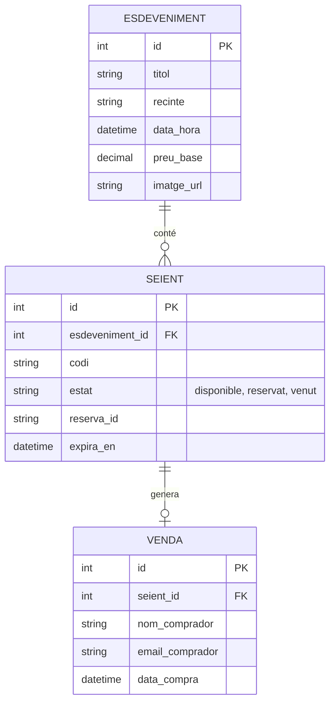
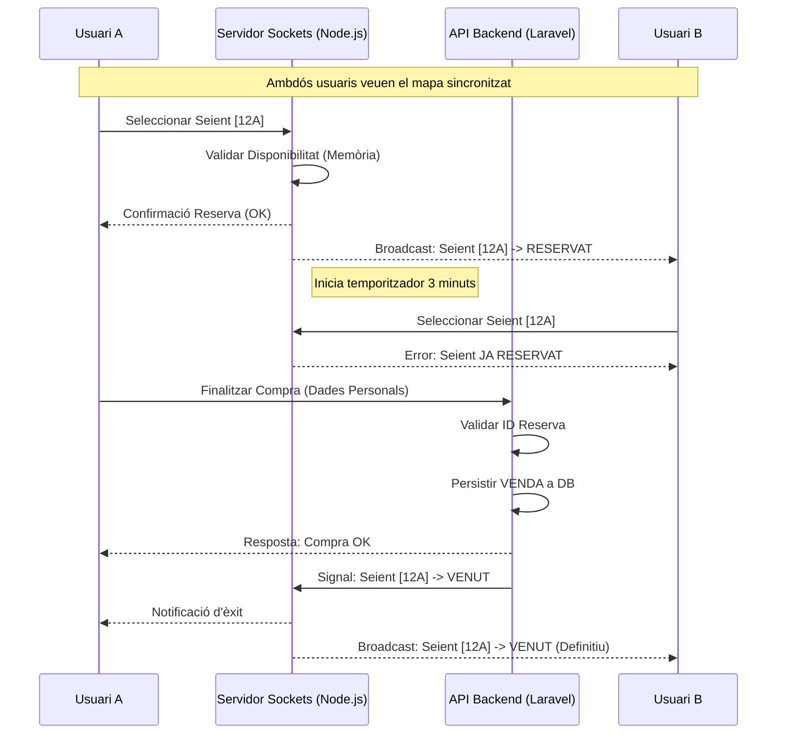

# Documentació Tècnica: Diagrames

Aquest document conté la representació visual del sistema segons els requeriments de l'enunciat del TR (Punt 6.3).

## 1. Diagrama d'Entitat-Relació (E/R)
Representa l'estructura de dades persistent a la base de dades SQL (Laravel).



## 2. Diagrama de Seqüència (Reserva i Compra via Socket.IO)
Representa el flux en temps real i la gestió de concurrència (Punt 4).



## 3. Diagrama de Casos d'Ús
Funcionalitats principals segons els rols (Usuari i Administrador).

```mermaid
useCaseDiagram
    actor "Usuari" as U
    actor "Administrador" as A

    package "Sistema de Venda" {
        usecase "Consultar Cartellera" as UC1
        usecase "Reservar Seient (Real-time)" as UC2
        usecase "Realitzar Pagament / Checkout" as UC3
        usecase "Consultar Entrades" as UC4
        
        usecase "Crear/Editar Esdeveniments" as UC5
        usecase "Monitoritzar Sala en Viu" as UC6
        usecase "Consultar Informes Vendes" as UC7
    }

    U --> UC1
    U --> UC2
    U --> UC3
    U --> UC4

    A --> UC5
    A --> UC6
    A --> UC7
```
